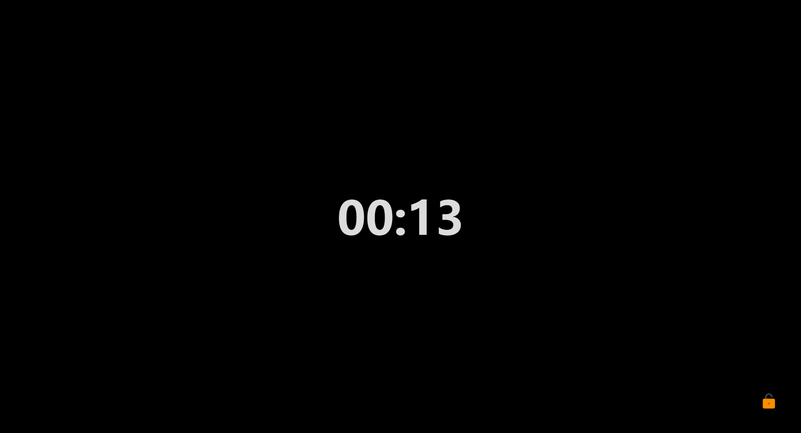

## Ease your eyes

This plug-in is intended to protect your eyes by resting the screen at regular intervals.

In the bottom right corner there is a countdown of the working time, when the countdown reaches zero it will go to the lock screen.

Once the countdown to the rest screen is over, it will resume working. You can exit the rest mode directly by clicking on the small lock in the bottom right corner.

You can set the relevant parameters of the plug-in in the settings panel. Clicking on the status bar countdown in the bottom right corner will quickly open the settings window.

